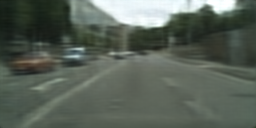
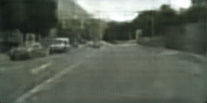
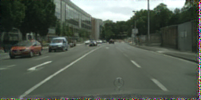
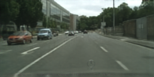
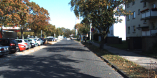
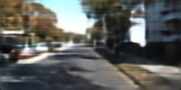
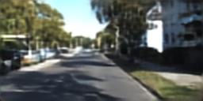
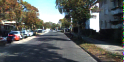
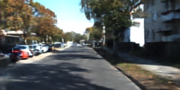

 # DPCON:Distortion-Perception Co-Optimization Network for Distributed Image Compression

## Setup
### Environment
* `Ubuntu 22.04.5 LTS`
* `Python 3.8.8`
* `PyTorch 1.8.0+cu111`

### Installation

```shell
conda env create --file environment.yml
conda activate dpcon
```


## Qualitative Results
### Cityscapes
<table align="center">
  <tr>
    <td align="center"><br><b>Ground Truth (bpp, PSNR&#8593, LPIPS&#8595)</b></td>
    <td align="center"><br><b>NDIC (0.041bpp, 27.60dB&#8593,  <br>0.2711&#8595)</b></td>
    <td align="center"><br><b>LDMIC (0.037bpp, 26.65dB&#8593, 0.2850&#8595)</b></td>
  </tr>
  <tr>
    <td align="center"><br><b>VAE-MFD (0.033bpp, 33.45dB&#8593, 0.1490&#8595)</b></td>
    <td align="center"><br><b>VAE-MFD + PO-PFI (0.033bpp, 22.83dB&#8593, 0.1262&#8595)</b></td>
    <td align="center"><br><b>DPCON (0.033bpp, 31.98dB&#8593, 0.1036&#8595)</b></td>
  </tr>
</table>

### KITTI Stereo
<table align="center">
  <tr>
    <td align="center"><br><b>Ground Truth (bpp, PSNR&#8593, LPIPS&#8595)</b></td>
    <td align="center"><br><b>NDIC (0.084bpp, 21.46dB&#8593, <br>0.3984&#8595)</b></td>
    <td align="center"><br><b>LDMIC (0.098bpp, 22.50dB&#8593, 0.3421&#8595)</b></td>
  </tr>
  <tr>
    <td align="center"><br><b>VAE-MFD (0.081bpp, 22.78dB&#8593, 0.1689&#8595)</b></td>
    <td align="center"><br><b>VAE-MFD + PO-PFI (0.081bpp, 20.62dB&#8593, 0.1328&#8595)</b></td>
    <td align="center"><br><b>DPCON (0.081bpp, 22.51dB&#8593, 0.1264&#8595)</b></td>
  </tr>
</table>


